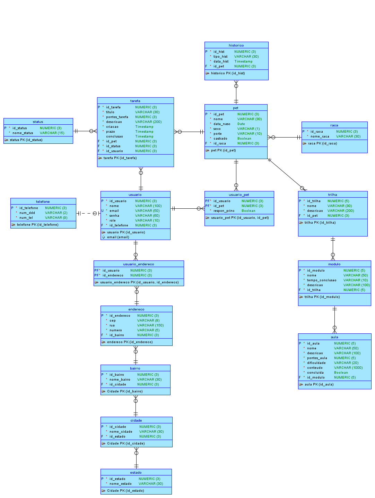
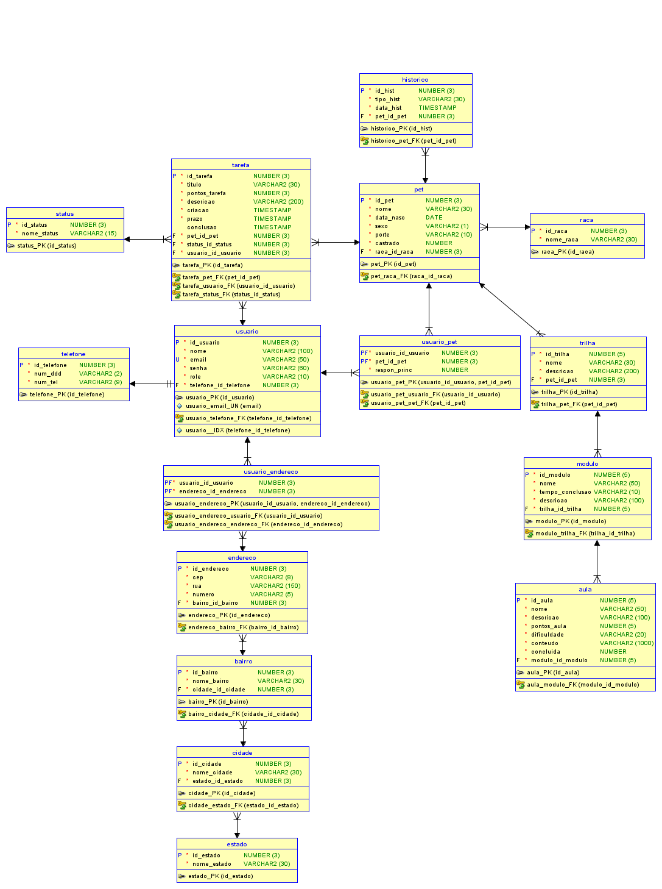

# Database-Advanced — 🐾 PetGuardian
> **Mastering Relational and Non-Relational Database (Oracle PL/SQL)**  
> Engenharia de Banco de Dados Relacional em 3FN, Programação Procedural Avançada (Subtotais Manuais sem ROLLUP, Serialização JSON Customizada sem Built-ins, Auditoria DML :OLD/:NEW e Tratamento Rigoroso de Exceções) - Challenge Clyvo 2026 — 2TDSPG.

---

## 👥 Integrantes

| Nome | RM | Turma | GitHub | LinkedIn |
| :--- | :---: | :---: | :--- | :--- |
| **Enzo Okuizumi** | **561432** | 2TDSPG | [EnzoOkuizumiFiap](https://github.com/EnzoOkuizumiFiap) | [Enzo Okuizumi](https://www.linkedin.com/in/enzo-okuizumi-b60292256/) |
| **Gustavo Okada** | **563428** | 2TDSPG | [Gdev3356](https://github.com/Gdev3356) | [Gustavo Okada](https://www.linkedin.com/in/gustavo-okada-53a3b8359/) |
| **Lucas Barros Gouveia** | **566422** | 2TDSPG | [LuzBGouveia](https://github.com/LuzBGouveia) | [Lucas Barros Gouveia](https://www.linkedin.com/in/lucas-barros-gouveia-09b147355/) |
| **Luna de Carvalho Guimarães** | **562290** | 2TDSPG | [lunaguima](https://github.com/lunaguima) | [Luna M. Guimarães](https://www.linkedin.com/in/luna-m-guimar%C3%A3es-1850ab173/) |
| **Milton Marcelino** | **564836** | 2TDSPG | [MiltonMarcelino](https://github.com/MiltonMarcelino) | [Milton Marcelino](http://linkedin.com/in/milton-marcelino-250298142) |

---

## 🔗 Links Oficiais de Entrega

* **Repositório GitHub:** [https://github.com/Challenge-Pet-Guardian-3/Database-Advanced](https://github.com/Challenge-Pet-Guardian-3/Database-Advanced)
* **Documentação Técnica PDF:** [`2TDSPG_2026_Proj_BD.pdf`](./docs/2TDSPG_2026_Proj_BD.pdf)
* **Script SQL:** [`2TDSPG_2026_CodigoSql_PetGuardian.sql`](./2TDSPG_2026_CodigoSql_PetGuardian.sql)

---

## Modelagem Lógica e Relacional do Banco de Dados

### Modelo Lógico


### Modelo Relacional (Físico)


---

## Contexto da Solução: 

Seguindo as diretrizes estratégicas da **Mentoria Clyvo 2026**, o ecossistema foi completamente refatorado:

1. **Descontinuação do Modelo Clínico Legado:** Foram removidas as entidades legadas de atendimento clínico (`veterinario`, `clinica`, `atendimento`, `tipo_atend`), que desviavam o foco da governança de rotina familiar do animal.
2. **O Animal no Centro do Domínio (`PET`):** O pet passa a ser a entidade principal do sistema. Todo o histórico de saúde, tarefas e pontuação converge para o indivíduo animal.
3. **Care Circle Familiar (`USUARIO_PET`):** Suporte à cotutela em relacionamento N:M entre usuários e pets, permitindo múltiplos cuidadores com a identificação clara do responsável principal (`respon_princ`).
4. **Gamificação da Rotina e Cuidado Preventivo (`TAREFA` e `STATUS`):** Tarefas com ciclo de vida auditável (`PENDENTE`, `CONCLUIDO`, `EXPIRADO`) e acúmulo de pontos de bem-estar.
5. **Gamificação Educativa (`TRILHA`, `MODULO`, `AULA`):** Módulos temáticos de adestramento e boas práticas vinculados ao perfil do pet, com concessão de pontuação educacional.
6. **Localização e Comunicação Segura (`ENDERECO`, `BAIRRO`, `CIDADE`, `ESTADO`, `TELEFONE`):** Normalização completa de contatos e endereços do tutor com integração declarativa de CEP.

---

## Dicionário de Dados Oficial (16 Tabelas + Tabela de Auditoria)

### 1. Tabela: `USUARIO`
Armazena os tutores, cuidadores e administradores da plataforma.

| Coluna | Tipo de Dados | Nulo? | Chave | Descrição / Regra |
| :--- | :--- | :---: | :---: | :--- |
| `id_usuario` | `NUMBER(3)` | Não | PK | Identificador único do usuário. |
| `nome` | `VARCHAR2(100)` | Não | - | Nome completo do usuário. |
| `email` | `VARCHAR2(50)` | Não | UN | E-mail corporativo/pessoal único no sistema. |
| `senha` | `VARCHAR2(60)` | Não | - | Hash criptográfico da senha (Ou senha de acesso do usuário). |
| `role` | `VARCHAR2(10)` | Não | CK | Perfil de acesso: `'ADMIN'`, `'COMUM'` ou `'PREMIUM'`. |
| `telefone_id_telefone` | `NUMBER(3)` | Não | FK, UN | Vínculo 1:1 com a tabela `telefone`. |

---

### 2. Tabela: `TELEFONE`
Contatos telefônicos associados aos usuários do sistema.

| Coluna | Tipo de Dados | Nulo? | Chave | Descrição / Regra |
| :--- | :--- | :---: | :---: | :--- |
| `id_telefone` | `NUMBER(3)` | Não | PK | Identificador único do telefone. |
| `num_ddd` | `VARCHAR2(2)` | Não | - | DDD do telefone (ex: `'11'`). |
| `num_tel` | `VARCHAR2(9)` | Não | - | Número do telefone com até 9 dígitos. |

---

### 3. Tabela: `PET` (Entidade Nuclear)
Armazena os animais gerenciados pela plataforma PetGuardian.

| Coluna | Tipo de Dados | Nulo? | Chave | Descrição / Regra |
| :--- | :--- | :---: | :---: | :--- |
| `id_pet` | `NUMBER(3)` | Não | PK | Identificador único do pet. |
| `nome` | `VARCHAR2(30)` | Não | - | Nome do pet. |
| `data_nasc` | `DATE` | Não | - | Data de nascimento para cálculo dinâmico de idade. |
| `sexo` | `VARCHAR2(1)` | Não | CK | Sexo do pet (`'F'` ou `'M'`). |
| `porte` | `VARCHAR2(10)` | Não | CK | Porte do pet: `'GRANDE'`, `'MEDIO'` ou `'PEQUENO'`. |
| `castrado` | `NUMBER` | Não | CK | Indicador binário de castração (`1` = Sim, `0` = Não). |
| `raca_id_raca` | `NUMBER(3)` | Não | FK | Referência para a raça do pet. |

---

### 4. Tabela: `USUARIO_PET` (Care Circle N:M)
Tabela associativa que formaliza a rede de cotutela sobre cada animal.

| Coluna | Tipo de Dados | Nulo? | Chave | Descrição / Regra |
| :--- | :--- | :---: | :---: | :--- |
| `usuario_id_usuario` | `NUMBER(3)` | Não | PK, FK | Referência ao usuário tutor. |
| `pet_id_pet` | `NUMBER(3)` | Não | PK, FK | Referência ao pet cuidado. |
| `respon_princ` | `NUMBER` | Não | CK | `1` se for o tutor principal, `0` se for co-cuidador. |

---

### 5. Tabela: `RACA`
Catálogo de raças caninas e felinas cadastradas.

| Coluna | Tipo de Dados | Nulo? | Chave | Descrição / Regra |
| :--- | :--- | :---: | :---: | :--- |
| `id_raca` | `NUMBER(3)` | Não | PK | Identificador único da raça. |
| `nome_raca` | `VARCHAR2(30)` | Não | - | Nome descritivo da raça (ex: `'Golden Retriever'`). |

---

### 6. Tabela: `TAREFA` (Tabela de Fatos da Rotina)
Fatos transacionais de alimentação, medicação, passeios e cuidados de saúde.

| Coluna | Tipo de Dados | Nulo? | Chave | Descrição / Regra |
| :--- | :--- | :---: | :---: | :--- |
| `id_tarefa` | `NUMBER(3)` | Não | PK | Identificador único da tarefa. |
| `titulo` | `VARCHAR2(30)` | Não | - | Título descritivo da tarefa. |
| `pontos_tarefa` | `NUMBER(3)` | Não | - | Pontos de bem-estar creditados ao concluir a tarefa. |
| `descricao` | `VARCHAR2(200)` | Não | - | Orientações detalhadas de execução. |
| `criacao` | `TIMESTAMP` | Não | - | Data/hora de registro da tarefa. |
| `prazo` | `TIMESTAMP` | Não | - | Data/hora limite de execução. |
| `conclusao` | `TIMESTAMP` | Sim | - | Data/hora efetiva em que a tarefa foi cumprida. |
| `pet_id_pet` | `NUMBER(3)` | Não | FK | Pet beneficiado pela tarefa. |
| `status_id_status` | `NUMBER(3)` | Não | FK | Status de controle (`PENDENTE`, `CONCLUIDO`, `EXPIRADO`). |
| `usuario_id_usuario` | `NUMBER(3)` | Não | FK | Cuidador responsável pela criação/execução. |

---

### 7. Tabela: `STATUS`
Domínio canônico de estados do ciclo de vida das tarefas.

| Coluna | Tipo de Dados | Nulo? | Chave | Descrição / Regra |
| :--- | :--- | :---: | :---: | :--- |
| `id_status` | `NUMBER(3)` | Não | PK | Identificador do status. |
| `nome_status` | `VARCHAR2(15)` | Não | CK | Restrição: `'CONCLUIDO'`, `'EXPIRADO'` ou `'PENDENTE'`. |

> **📌 Nota Arquitetural (Domínio Fechado / Máquina de Estados):**  
> A tabela `STATUS` atua como uma Máquina de Estados Finita para a rotina de cuidados do pet. Ela é estritamente restrita aos 3 estados canônicos do sistema (`PENDENTE`, `CONCLUIDO`, `EXPIRADO`), conforme validado pela constraint `ck_status_nome`. Criar status arbitrários adicionais violaria o domínio fechado e as regras de negócio da aplicação. Todas as demais tabelas do projeto atendem à métrica de 5 ou mais registros válidos.

---

### 8. Tabela: `TRILHA`
Trilhas temáticas de educação, adestramento e enriquecimento ambiental.

| Coluna | Tipo de Dados | Nulo? | Chave | Descrição / Regra |
| :--- | :--- | :---: | :---: | :--- |
| `id_trilha` | `NUMBER(5)` | Não | PK | Identificador único da trilha. |
| `nome` | `VARCHAR2(30)` | Não | - | Nome da trilha temática. |
| `descricao` | `VARCHAR2(200)` | Não | - | Detalhamento dos objetivos pedagógicos. |
| `pet_id_pet` | `NUMBER(3)` | Não | FK | Pet associado ao plano de desenvolvimento. |

---

### 9. Tabela: `MODULO`
Módulos que segmentam o conteúdo programático de uma trilha.

| Coluna | Tipo de Dados | Nulo? | Chave | Descrição / Regra |
| :--- | :--- | :---: | :---: | :--- |
| `id_modulo` | `NUMBER(5)` | Não | PK | Identificador único do módulo. |
| `nome` | `VARCHAR2(50)` | Não | - | Título do módulo. |
| `tempo_conclusao` | `VARCHAR2(10)` | Não | - | Estimativa de tempo de conclusão (ex: `'45 min'`). |
| `descricao` | `VARCHAR2(100)` | Não | - | Resumo do conteúdo trabalhado no módulo. |
| `trilha_id_trilha` | `NUMBER(5)` | Não | FK | Referência para a trilha pai. |

---

### 10. Tabela: `AULA`
Aulas práticas com pontuação educativa e acompanhamento de progresso.

| Coluna | Tipo de Dados | Nulo? | Chave | Descrição / Regra |
| :--- | :--- | :---: | :---: | :--- |
| `id_aula` | `NUMBER(5)` | Não | PK | Identificador único da aula. |
| `nome` | `VARCHAR2(50)` | Não | - | Título da lição. |
| `descricao` | `VARCHAR2(100)` | Não | - | Descrição curta da prática. |
| `pontos_aula` | `NUMBER(5)` | Não | - | Pontuação concedida ao pet/tutor ao concluir. |
| `dificuldade` | `VARCHAR2(20)` | Não | - | Nível de dificuldade (`INICIANTE`, `INTERMEDIARIO`, etc.). |
| `conteudo` | `VARCHAR2(1000)` | Não | - | Texto instrutivo ou instruções práticas. |
| `concluida` | `NUMBER` | Não | CK | `1` se concluída, `0` se pendente. |
| `modulo_id_modulo` | `NUMBER(5)` | Não | FK | Referência para o módulo pai. |

---

### 11. Tabela: `HISTORICO`
Prontuário de eventos de saúde e intervenções preventivas do animal.

| Coluna | Tipo de Dados | Nulo? | Chave | Descrição / Regra |
| :--- | :--- | :---: | :---: | :--- |
| `id_hist` | `NUMBER(3)` | Não | PK | Identificador do evento histórico. |
| `tipo_hist` | `VARCHAR2(30)` | Não | - | Categoria do evento (Vacina, Check-up, Cirurgia). |
| `data_hist` | `TIMESTAMP` | Não | - | Data e hora exata do evento de saúde. |
| `pet_id_pet` | `NUMBER(3)` | Não | FK | Pet vinculado ao histórico. |

---

### 12. Tabela: `ENDERECO`
Logradouros físicos normalizados vinculados aos usuários.

| Coluna | Tipo de Dados | Nulo? | Chave | Descrição / Regra |
| :--- | :--- | :---: | :---: | :--- |
| `id_endereco` | `NUMBER(3)` | Não | PK | Identificador único do endereço. |
| `cep` | `VARCHAR2(8)` | Não | - | Código postal numérico de 8 posições. |
| `rua` | `VARCHAR2(150)` | Não | - | Logradouro (rua, avenida, travessa). |
| `numero` | `VARCHAR2(5)` | Não | - | Número predial. |
| `bairro_id_bairro` | `NUMBER(3)` | Não | FK | Referência para a tabela `bairro`. |

---

### 13. Tabela: `USUARIO_ENDERECO` (N:M)
Associação flexível de múltiplos endereços por usuário.

| Coluna | Tipo de Dados | Nulo? | Chave | Descrição / Regra |
| :--- | :--- | :---: | :---: | :--- |
| `usuario_id_usuario` | `NUMBER(3)` | Não | PK, FK | Referência ao usuário. |
| `endereco_id_endereco` | `NUMBER(3)` | Não | PK, FK | Referência ao endereço cadastrado. |

---

### 14. Tabela: `BAIRRO`
Divisão territorial urbana normalizada (3FN).

| Coluna | Tipo de Dados | Nulo? | Chave | Descrição / Regra |
| :--- | :--- | :---: | :---: | :--- |
| `id_bairro` | `NUMBER(3)` | Não | PK | Identificador único do bairro. |
| `nome_bairro` | `VARCHAR2(30)` | Não | - | Nome descritivo do bairro. |
| `cidade_id_cidade` | `NUMBER(3)` | Não | FK | Referência para a tabela `cidade`. |

---

### 15. Tabela: `CIDADE`
Municípios cadastrados (3FN).

| Coluna | Tipo de Dados | Nulo? | Chave | Descrição / Regra |
| :--- | :--- | :---: | :---: | :--- |
| `id_cidade` | `NUMBER(3)` | Não | PK | Identificador único da cidade. |
| `nome_cidade` | `VARCHAR2(30)` | Não | - | Nome do município. |
| `estado_id_estado` | `NUMBER(3)` | Não | FK | Referência para a tabela `estado`. |

---

### 16. Tabela: `ESTADO`
Unidades Federativas brasileiras (3FN).

| Coluna | Tipo de Dados | Nulo? | Chave | Descrição / Regra |
| :--- | :--- | :---: | :---: | :--- |
| `id_estado` | `NUMBER(3)` | Não | PK | Identificador único do estado. |
| `nome_estado` | `VARCHAR2(30)` | Não | - | Nome por extenso da Unidade Federativa. |

---

### 17. Tabela: `AUDITORIA_DML_TAREFA` (Requisito Estrito da Pág. 28 do Manual)
Estrutura dedicada à rastreabilidade transacional da tabela de fatos `TAREFA`.

| Coluna | Tipo de Dados | Nulo? | Chave | Descrição / Regra Oficial |
| :--- | :--- | :---: | :---: | :--- |
| `id_auditoria` | `NUMBER` | Não | PK | Identificador autoincremental (`IDENTITY`). |
| `nome_usuario` | `VARCHAR2(50)` | Não | - | Nome do usuário de banco conectado (`USER`). |
| `tipo_operacao` | `VARCHAR2(10)` | Não | - | Operação disparada: `'INSERT'`, `'UPDATE'` ou `'DELETE'`. |
| `data_hora_operacao` | `TIMESTAMP` | Não | - | Timestamp da transação (`SYSTIMESTAMP`). |
| `valores_anteriores` | `VARCHAR2(4000)` | Sim | - | Estado completo dos campos `:OLD` da linha. |
| `valores_novos` | `VARCHAR2(4000)` | Sim | - | Estado completo dos campos `:NEW` da linha. |

---

## Especificação das Funções, Procedimentos e Gatilho (Sprint 3)

### 1. Função 1: `fn_tarefa_json`
* **Objetivo:** Receber o identificador de uma tarefa (`p_id_tarefa`), realizar JOIN relacional com `pet`, `status` e `usuario`, e retornar uma string formatada em JSON com a ficha da atividade.
* **Regra Anti-Penalidade:** **ZERO USO de funções built-in do Oracle** (`TO_JSON`, `JSON_OBJECT`, `JSON_VALUE`, etc.), cuja infração desconta -10 pontos por ocorrência. A concatenação e tratamento de caracteres de escape (`\` e `"`) é 100% manual em PL/SQL.
* **Tratamento de Exceções (Mínimo 3 distintas):**
  1. `e_id_nulo_invalido`: Disparada quando o ID é nulo ou `<= 0` (ORA-20001).
  2. `NO_DATA_FOUND`: Disparada quando a tarefa não existe na base (ORA-20002).
  3. `e_json_excedente`: Disparada caso a string gerada exceda 3800 bytes (ORA-20003).
  4. `WHEN OTHERS`: Tratamento genérico com captura de `SQLERRM` (ORA-20004).

---

### 2. Procedimento 1: `pr_listar_tarefas_json`
* **Objetivo:** Executar consulta multitabelas com JOIN explícito entre `tarefa`, `pet`, `status` e `usuario`, consumindo a **Função 1** para cada linha processada e exibindo a coleção serializada via `DBMS_OUTPUT`.
* **Tratamento de Exceções (Mínimo 3 distintas):**
  1. `e_status_inexistente`: Validação prévia de existência do ID de status fornecido (ORA-20005).
  2. `e_sem_registros`: Disparada quando nenhuma tarefa é localizada para o filtro (ORA-20006).
  3. `CURSOR_ALREADY_OPEN`: Proteção contra tentativa de abertura duplicada de cursor (ORA-20007).
  4. `WHEN OTHERS`: Fechamento seguro de cursor e reporte de erro (ORA-20008).

---

### 3. Função 2: `fn_classificar_pontos`
* **Objetivo:** Processo lógico corporativo de gamificação que recebe uma quantidade numérica de pontos e retorna a faixa hierárquica correspondente:
  * `<= 20`: `BRONZE (BÁSICO)`
  * `<= 45`: `PRATA (INTERMEDIÁRIO)`
  * `<= 75`: `OURO (AVANÇADO)`
  * `> 75`: `DIAMANTE (MASTER)`
* **Tratamento de Exceções (Mínimo 3 distintas):**
  1. `e_pontos_nulo`: Parâmetro nulo não permitido (ORA-20009).
  2. `e_pontos_negativo`: Valores negativos são inválidos no domínio (ORA-20010).
  3. `e_pontos_excesso`: Pontuação acima do teto regulamentar de 1000 pontos (ORA-20011).
  4. `WHEN OTHERS`: Falha imprevista de execução (ORA-20012).

---

### 4. Procedimento 2: `pr_resumo_pontos_tarefas`
* **Objetivo:** Processar a tabela de fatos `TAREFA` agregando duas colunas categóricas (`PET` como Categoria 1 e `STATUS` como Categoria 2) e a coluna numérica `PONTOS_TAREFA`.
* **Regras Mandatórias do Professor:**
  1. **PROIBIDO o uso de `ROLLUP`, `CUBE`, `GROUPING SETS`, `GROUPING` ou similares** (Penalidade gravíssima de nota).
  2. **Cursor SQL Puro:** Leitura direta de fatos detalhados **sem `SUM()` e sem `GROUP BY`** no SQL, evitando qualquer delegação de agregação ao motor do Oracle.
  3. **Somatório 100% Manual:** Acumulação de pontos em três níveis (combinação Pet + Status, subtotal por Pet e total geral) calculada exclusivamente por variáveis no laço procedural do PL/SQL.
  4. **Apresentação Visual Idêntica ao Slide 26:** Formatação em colunas tabuladas (`RPAD`/`LPAD`), com Subtotal e Total Geral na coluna de pontuação e categorias ausentes (em branco):
```text
Pet (Cat 1)        Status (Cat 2)         Pontos
------------------ ---------------- ------------
1 - Thor           1 - PENDENTE            50.00
1 - Thor           2 - CONCLUIDO           25.00
1 - Thor           3 - EXPIRADO            15.00
Sub Total                                  90.00
2 - Mel            1 - PENDENTE            20.00
2 - Mel            2 - CONCLUIDO           60.00
Sub Total                                  80.00
Total Geral                               170.00
```
* **Tratamento de Exceções (Mínimo 3 distintas):**
  1. `e_sem_fatos_cadastrados`: Tabela vazia sem registros para agregação (ORA-20013).
  2. `VALUE_ERROR`: Erro de conversão numérica ou estouro aritmético (ORA-20014).
  3. `WHEN OTHERS`: Captura resiliente com garantia de liberação de cursor (ORA-20015).

---

### 5. Trigger de Auditoria DML: `trg_audit_tarefa`
* **Objetivo:** Auditoria transacional completa disparada em modo `AFTER INSERT OR UPDATE OR DELETE ON tarefa FOR EACH ROW`.
* **Persistência na Tabela `AUDITORIA_DML_TAREFA`:**
  * Nome do usuário de banco (`USER`).
  * Tipo de operação realizada (`'INSERT'`, `'UPDATE'`, `'DELETE'`).
  * Data e hora com precisão de frações de segundo (`SYSTIMESTAMP`).
  * Valores anteriores (`:OLD`) serializados em texto identificando coluna e valor.
  * Valores novos (`:NEW`) serializados em texto identificando coluna e valor.
